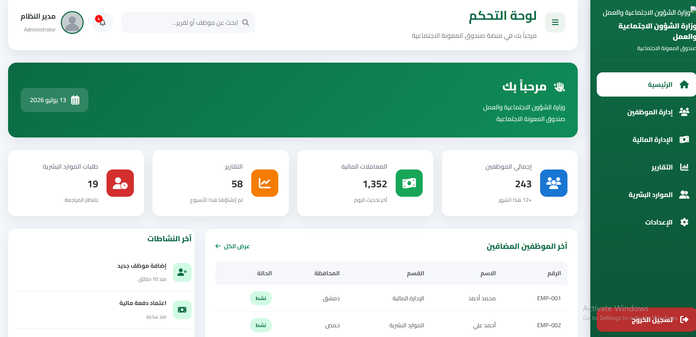
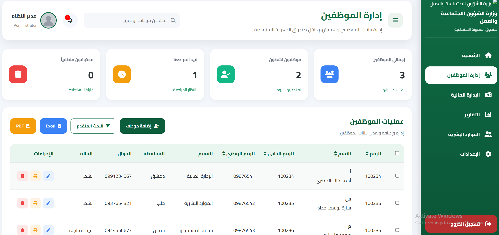
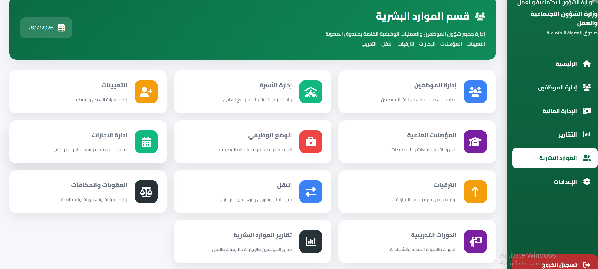
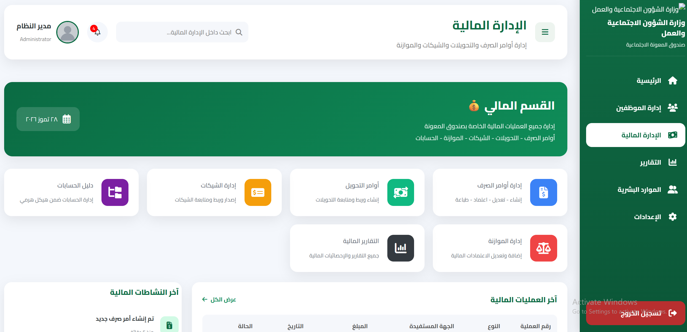
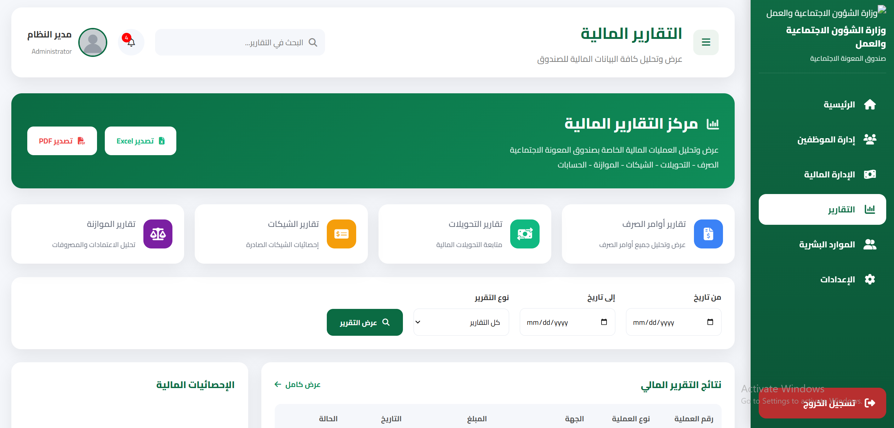

# 🏛️ Tamkeen Front-End

A modern, responsive, and scalable Front-End Dashboard for the **Social Assistance Fund Management System**, built with HTML, CSS, and JavaScript.

---

## 📖 Overview

Tamkeen is a modern administrative dashboard designed to simplify the management of the Social Assistance Fund. The project focuses on providing a clean, intuitive, and responsive user interface for managing employees, finance, human resources, and reports.

---

## ✨ Features

- 📊 Interactive Dashboard
- 👥 Employee Management
- 💼 Human Resources (HR)
- 💰 Finance Management
- 📑 Financial Reports
- 🏦 Accounts Directory
- 💳 Payment Orders
- 🔄 Financial Transfers
- 📈 Performance Evaluation
- 🎓 Training Management
- ⚙️ System Settings
- 📱 Fully Responsive Design

---

## 🛠️ Technologies

- HTML5
- CSS3
- JavaScript (ES6)
- Git
- GitHub

---

## 📸 Screenshots

### 🏠 Dashboard


### 👥 Employee Management


### 💼 Human Resources


### 💰 Finance


### 📊 Reports


## 📂 Project Structure

```text
front-end/
└── ui/
    ├── assets/
    │   ├── css/
    │   ├── js/
    │   ├── images/
    │   └── SVG/
    └── pages/
```

## 🎯 Objectives

- Modern and responsive interface
- Clean and maintainable code
- User-friendly experience
- Organized project structure
- Easy future integration with backend

---

## 🚀 Status

🚧 Front-End development is currently in progress.

---

## 👨‍💻 Developer

**Adnan Alkrde**

Front-End Developer

---

## ⭐ Support

If you like this project, don't forget to leave a ⭐ on the repository.
